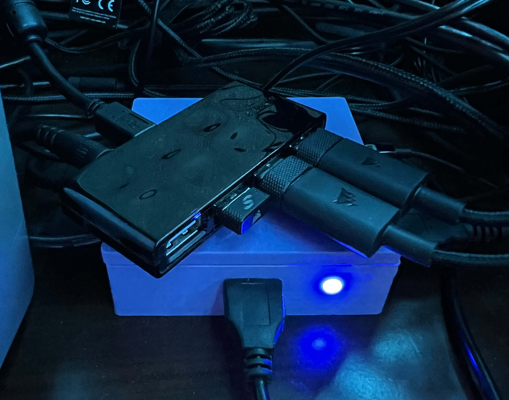
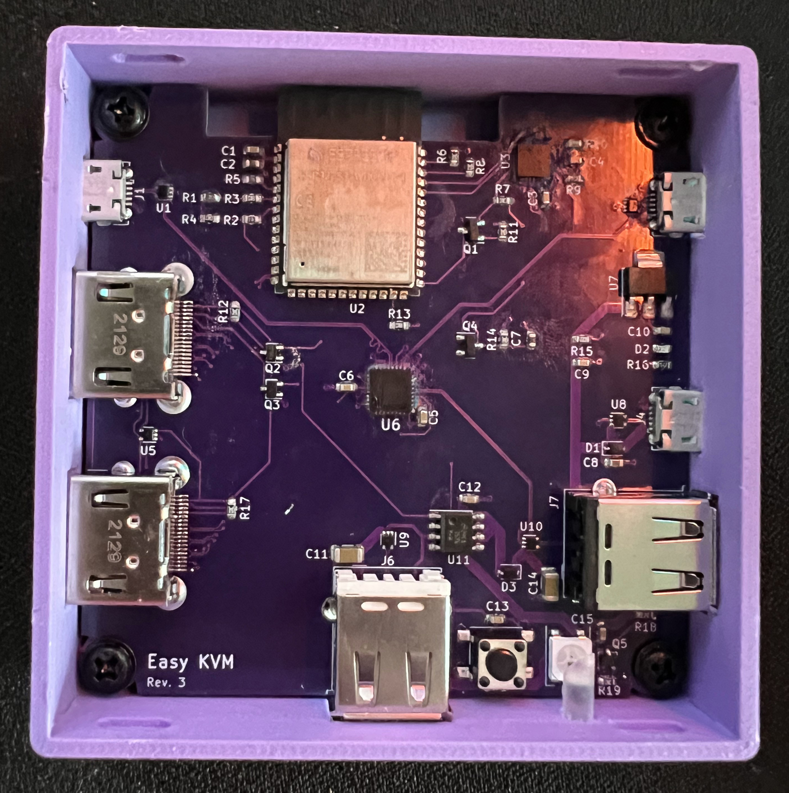
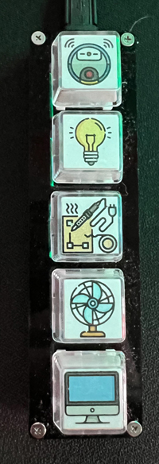
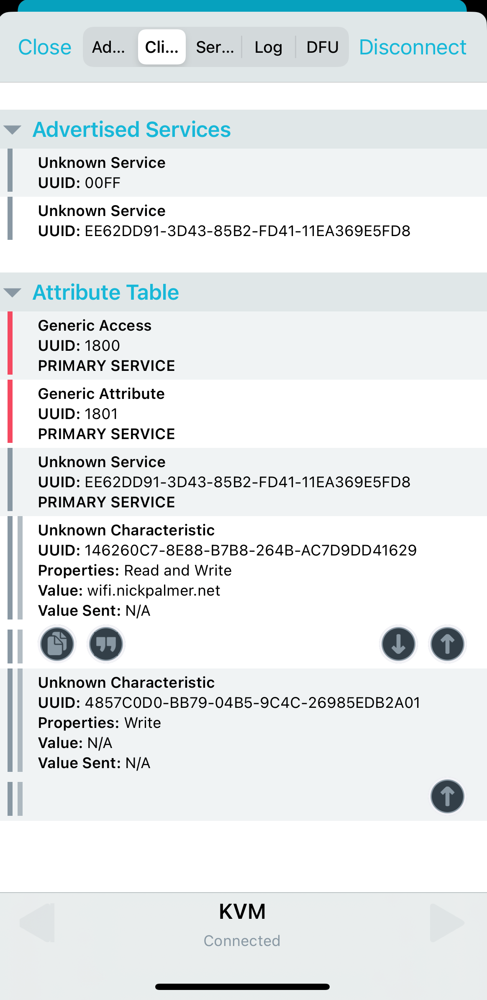
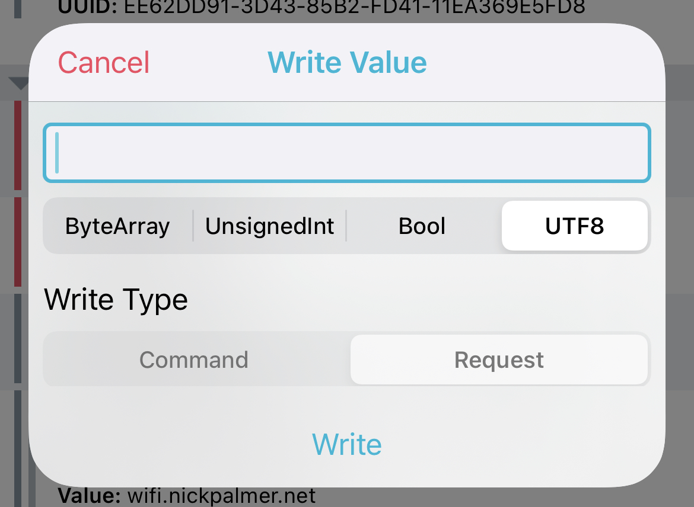

# _Easy KVM_

## About Easy KVM

Easy KVM is a Wi-Fi enabled hybrid KVM.  It acts a an USB sharing switch and VESA DDC/CI based switcher.  It does not touch the video signal which eliminates a lot of issues found with standard KVMs.





## Features

* Single USB 2.0 high speed capable port to be used with an external USB hub
* Wi-Fi control
* HDMI passthrough
* USB keyboard for macros and port switching
* Control monitor power state
* Integrated with Home Assistant

## External Requirements
* USB macro keypad e.g. [Amazon](https://www.amazon.com/gp/product/B09CKT8B7) [AliExpress](https://www.aliexpress.us/item/3256804248423460.html)
* USB 2.0 high speed hub e.g. [Amazon](https://www.amazon.com/gp/product/B005A0B3FG)
* Monitor with an HDMI port that supports VESA DDC/CI

## Port Setup
1. Connect source HDMI cable from video card to either one of the HDMI ports
2. Connect other HDMI port to monitor
3. Connect J1 Micro USB (top left) to PC1 USB
4. Connect J2 Micro USB (top right) to PC2 USB
5. Connect J6 Micro USB (bottom renter) to macro keypad
6. Connect J7 USB (bottom right) to USB hub
7. Connect J4 Micro USB (Center right) to either USB power or PC (for programming and serial monitoring)

## Wi-Fi Setup
Wi-Fi network selection is done through bluetooth.  
1. Download nRF Connect and connect to KVM
2. Open the client services tab and click Write Value the (up arrow) on the characteristic ending with an UUID of 29.  

3. Click the UTF-8 tab and enter the network SSID and click Write.

4. Click Write Value on the characteristic ending in 01.  This is the Wi-Fi password.  After clicking Write, the KVM should connect to the network.

## WebServer End Points

| URL | Method | Function | Payload |
| --- | ------ | -------- | ------- |
|/config|GET|Open configuration page||
|/monitor|GET|Return monitor state|`{	"on":	true }`|
|/monitor|POST|Set monitor state|`{	"on":	true }`|
|/kvm|GET|Return selected KVM port|`{ "kvm":	1 }`|
|/kvm/1|GET|Select KVM port 1||
|/kvm/2|GET|Select KVM port 2||

## Home Assistant
The KVM needs a Long-Lived Access Token to interact with home assistant.  Create one from the home assistant profile page and save it for later (e.g. notepad)

### Monitor Switch

Copy code below into the home assistant switches.yaml file.  This will create a switch in home assistant that can be used to turn the connected monitor on and off.
```
- platform: rest
  name: "Office Monitor"
  unique_id: 08a5830e-3309-4998-9d17-7ea7ecf154fd
  resource: http://<<KVM_HOST_NAME_OR_IP>>/monitor
  timeout: 30
  body_on: '{"on": true}'
  body_off: '{"on": false}'
  is_on_template: "{{ value_json.on }}"
  headers:
    Content-Type: application/json
```

## Configuration
1. Determine the IP of the KVM either from router UI or connecting the KVM to a computer and viewing the serial output.
2. Navigate to http://KVM_IP/config
3. Select the desired source and RGB led color for each input
4. Enter home assistant URL and previously created access token
5. Configure the macro keypad functions
6. Click save

Note clipboard import/export only work if you have the KVM behind an https proxy

## Usage
Once properly configured, the inputs can be switched using the configured macro keypad button or through the web server end points